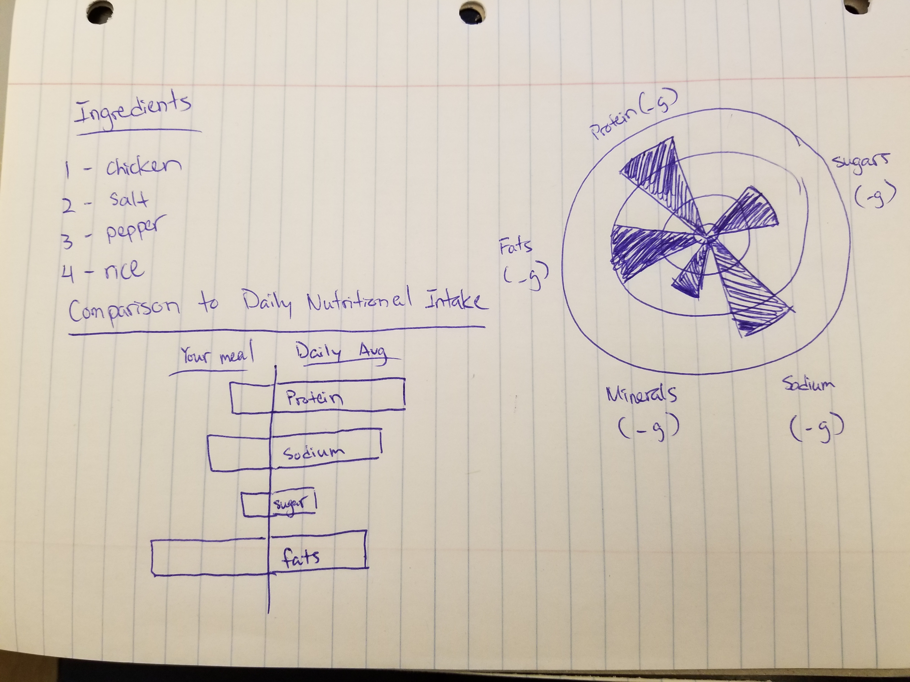
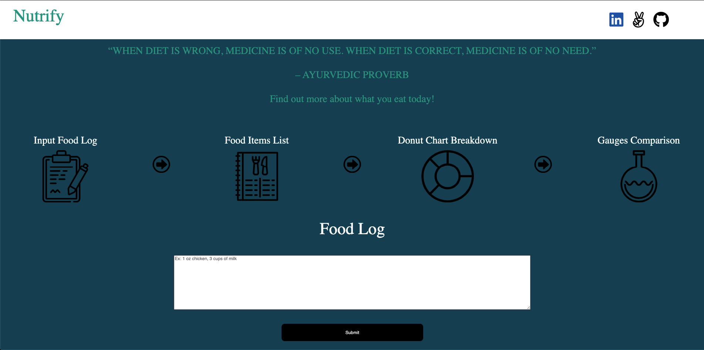

# Nutrify

[Nutrify Live Site](https://henrytan0705.github.io/Nutrify-JS-Project/)

# Background and Overview
Nutrify is a nutrional breakdown data visualization of a food items that users input.
Enjoying food is great, but we should also keep check of what we're eating and how much we're eating. Food nutrition is a vital factor in our health.
This data reflects the nutrional values ingredients have and compares it the average intake one should have in a given day.

Nutritionix is a free available API that filters user input and returns the nutrional breakdown values of given ingredients found within their database.

# Functionality and MVP
Users are able to:
- [ ] Enter a list of ingredients or a food log
- [ ] Get nutritional value of food broken down into sections
- [ ] Get a comparison of the meal's nutrition to a daily average intake

<!-- # Wireframes
 -->

# Architecture and Technology

- Vanilla Javascript for handling the logic and shaping the data received from Nutritionix
- D3.js for to inject data into the DOM to create liquid fill gauges and manipulate data
- Chart.js to visualize data into simple, but elegant charts
- CSS3 for styling the visualization
- HTML5 for basic structure of layout
- Webpack for bundling scripts for modular composition of Javascript files

# Features

Nutrify is a straight forward application, whereas users only have to input the data they want calculated and submit it.

## Nutritonix API Usage
    let foodData = {
        "query": formValue,            //user input 
        "timezone":"US/Eastern"
    };

    function postData(url = '', data = {}) {
        return fetch(url, {
            method: 'POST',
            mode: 'cors',
            cache: 'no-cache',
            credentials: 'same-origin',
            headers: {
                'Content-Type': 'application/json',
                "x-app-id": "c6356694",
                "x-app-key": "#############################",
                "x-remote-user-id": 0
            },
            redirect: 'follow',
            referrer: 'no-referrer',
            body: JSON.stringify(data),
        })
            .then(response => response.json());
    }

    postData('https://trackapi.nutritionix.com/v2/natural/nutrients', foodData)
        .then( data => {...} )
        .catch( error => {...} )

- User data is passed into an specifically formatted object's key value of "query"
- Object is then sent to url of Nutritonix API, returning data/error 

# Data Breakdown

- User input is displayed using 2 types of diagrams 
  * Donut Chart - A general representation of each nutrional category in comparison to each other in units of grams.
  * Liquid Fill Gauges - Representing data with a liquid animation filling up in comparison to daily FDA nutrional diet.

- Nutritonal Sections include:
  * Calories
  * Protein
  * Carbs
  * Fat
  * Sodium
  * Cholesterol
  * Sugar

- A list of ingredients will be generated as well to keep track of what has been calculated from the user's input

<!-- # Implementation Timeline
## 8/13 Tuesday 
* Research D3 charts
* Research Chart.js
* Fetch data from API
* Format/filter necessary data for charts

## 8/14 Wednesday
* Find new API to replace down API
* Format/filter new data
* Start structuring design layout

## 8/15 Thursday
* Researching D3 Liquid Fill Gauge
* Structuring design layout

## 8/16 Friday
* Implementing D3 Liquid Fill Gauge 
* Structuring design layout

## 8/17 Saturday
* Implement CSS styling and effects accordingly
 -->

